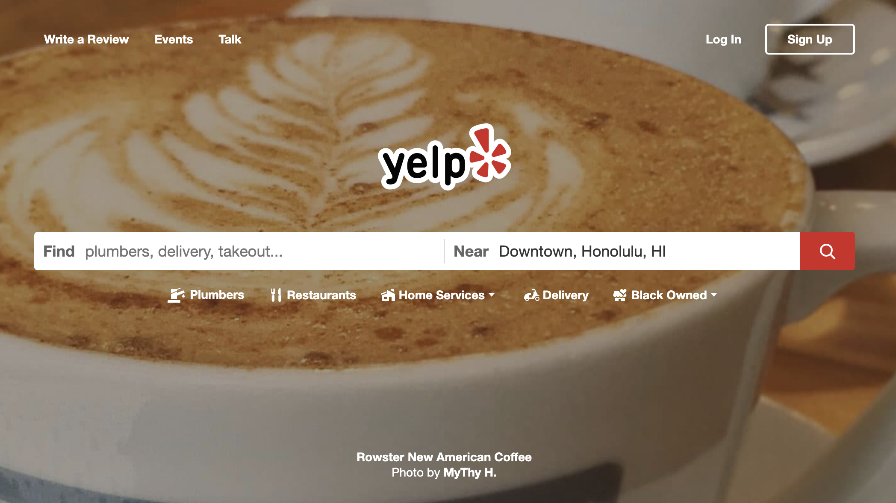
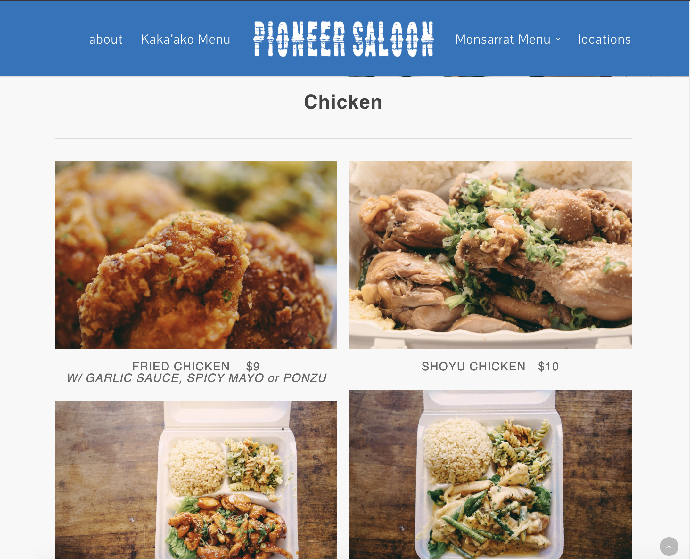
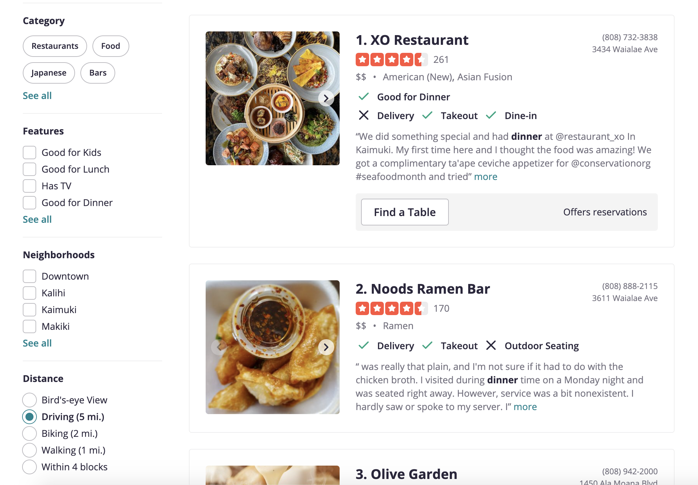
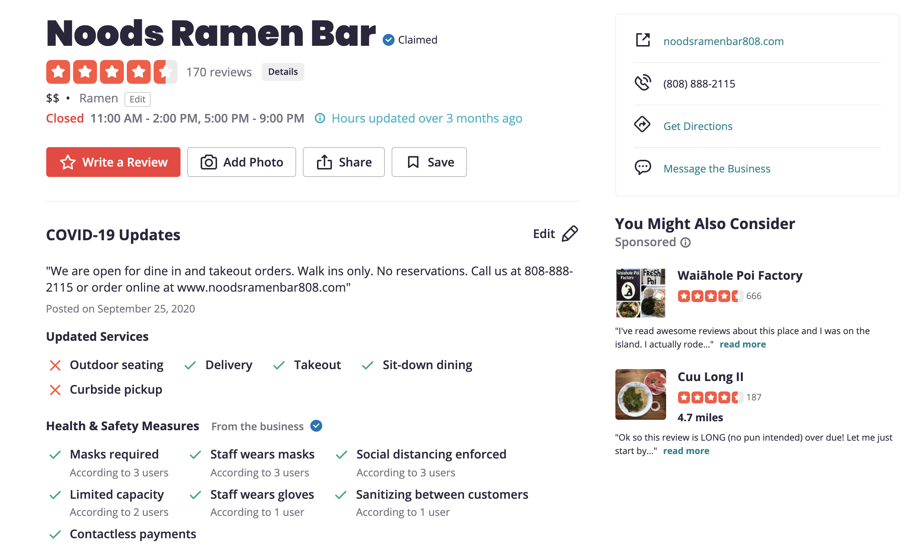

# gruhb-doc.github.io

## Table of contents

- [Overview](#overview)
- [User Guide](#user-guide)

## Overview

Gruhb doc is a web application that provides available food vendors and menu items for UH Manoa.

- [Meteor](https://www.meteor.com/) for Javascript-based implementation of client and server code.
- [React](https://reactjs.org/) for component-based UI implementation and routing.
- [Semantic UI React](https://react.semantic-ui.com/) CSS Framework for UI design.
- [Uniforms](https://uniforms.tools/) for React and Semantic UI-based form design and display.

The goals of the project are:

- Create a simple user interface and experience for anyone on the UH Manoa campus who want an easy-to-use tool for looking for food vendors.
- Learn and practice web development by using techniques we learned in this course and by also doing our own research.
- Learn how to work on a project with a group of people.
- Gain experience with project management (i.e. Git, issues, branches, etc.).

As stated as the first goal of the project, the system should eventually provide an easy-to-use tool for anyone who finds themselves on the UH Manoa campus and need to find a place to eat.

## User Guide

This section provides a walkthrough of the Gruhb Doc user interface and its capabilities.

### Landing Page

The landing page is presented to users when they visit the top-level URL to the site. We plan to use [Yelp's](https://www.yelp.com) home page as a basis for the overall layout and design.

### Sign in and sign up

The user will be able to “Login” or “Sign Up” on the top right corner of the page. We will once again be using [Yelp's](https://www.yelp.com) homepage as a basis for designing the layout of the user account functionality.

### Home page (Vendors, Profile, Favorites)

The user home page of Gruhb Doc will allow the user to navigate through three different pages, the vendors, profile, and favorites. We will be basing this design off of [Pioneer Saloon’s](http://www.pioneer-saloon.net) website. On the home page, the user will also see the top pick of the day.

### Vendors

The Vendors page will be presented in a feed type of format. Users will be able to filter the page and favorite a vendor from the list of vendors. We will be basing this design off of [Yelp's](https://www.yelp.com) feed design.

### Profile page

Once the user is logged in, they will be able to access a profile page where they can edit their personal information. We will be basing this design off of [Instagram’s](https://www.instagram.com) edit profile design.

### Favorites

The Favorites page will be once again presented in a feed type of format. Users will be able to see a feed of their favorite vendors for easy access. We will be basing this design off of [Instagram's](https://www.instagram.com) feed design.

### Vendor

After a user clicks on a vendor from the Vendors page, the Vendor page will be displayed and the details of the vendors like the hours, menu, cuisine etc. will be shown to the user. We will be basing this design off of [Yelp's](https://www.yelp.com) vendor page design.

