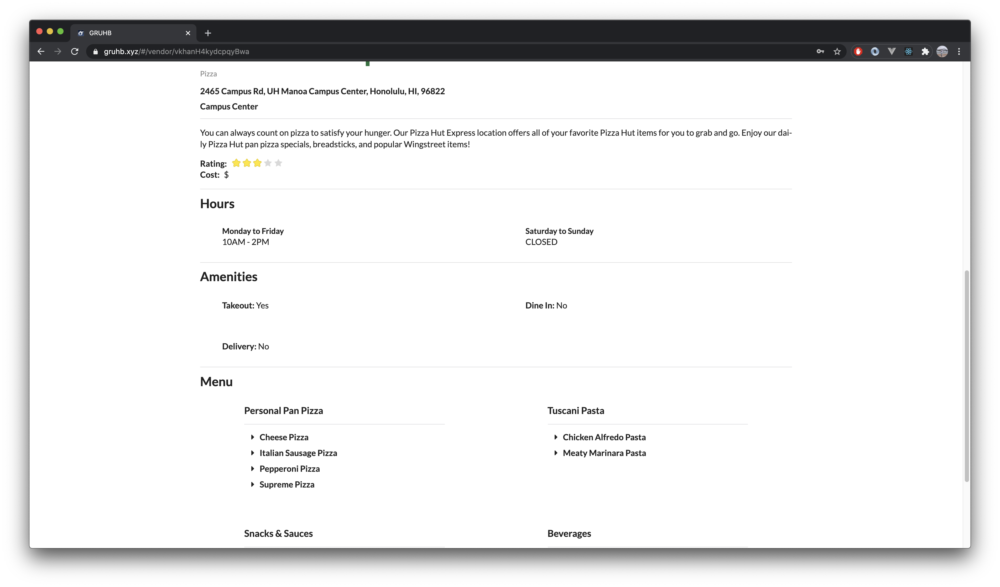

# [Gruhb](https://gruhb.xyz)


## Table of contents

- [Overview](#overview)
- [Deployed Website](#deployed-website)
- [User Guide](#user-guide)
- [Build Process](#build-process)
- [Developer Guide](#developer-guide)
- [The Team](#the-team)

## Overview

Gruhb is a web application that provides available food vendors and menu items for UH Manoa.

[Visit our GitHub Organization here.](https://github.com/gruhb-doc)

- [Meteor](https://www.meteor.com/) for Javascript-based implementation of client and server code.
- [React](https://reactjs.org/) for component-based UI implementation and routing.
- [Semantic UI React](https://react.semantic-ui.com/) CSS Framework for UI design.
- [Uniforms](https://uniforms.tools/) for React and Semantic UI-based form design and display.

The goals of the project are:

- Create a simple user interface and experience for anyone on the UH Manoa campus who want an easy-to-use tool for looking for food vendors.
- Learn and practice web development by using techniques we learned in this course and by also doing our own research.
- Learn how to work on a project with a group of people.
- Gain experience with project management (i.e. Git, issues, branches, etc.).

As stated as the first goal of the project, the system will provide an easy-to-use tool for anyone who finds themselves on the UH Manoa campus and need to find a place to eat.

## Deployed Website

[Visit our deployed website here!](https://gruhb.xyz)

---

# Build Process

## Milestone 1 (DONE):

[Visit the Milestone 1 project board here](https://github.com/gruhb-doc/gruhb-doc/projects/1).

- In this milestone, we created the landing page of the web app and deployed the project to [Digital Ocean](https://www.digitalocean.com/).
- This milestone was mainly about getting the web app started, getting familiar with **issues driven project management**, and learning how to use [GitHub's Automated Kanban project board](https://github.com/gruhb-doc/gruhb-doc/projects/1).

## Milestone 2 (DONE):

[Visit the Milestone 2 project board here](https://github.com/gruhb-doc/gruhb-doc/projects/2).

- In this milestone, we created our main pages for the web app.
- We created the Log In, Sign Up, Sign Out, Home Page, and Vendor pages.
- We were also met with some difficulty setting up our data schema and figuring out how to properly store data from a form. We were not able to get our data collections working in time before this milestone has ended.

## Milestone 3 (IN PROGRESS):

[Visit the Milestone 3 project board here](https://github.com/gruhb-doc/gruhb-doc/projects/4).

- In this milestone, we will be finishing up the web app as a whole.
- We will be adding an About Us page and a filtering feature for the home page vendor feed.
- We will be adding finishing touches.
- We will have a working data collection and the Vendor page will no longer show the mockup data.

# User Guide

This section provides a walkthrough of the user interface for Gruhb.

### Landing Page

The [landing page](http://178.128.184.132) is presented to users when they visit the top-level URL to the site. We based our design and layout on [Yelp's](https://www.yelp.com) home page. [See it live here](http://178.128.184.132).


#### With footer:


### Log In, Sign Up, and Sign Out Page

The user will be able to “Login”, “Sign Up”, or "Sign Out" on the top right corner of the page. All three pages generally follow the same design.

**Log In**


**Sign Up**


**Sign Out**


### Home Page (Vendors, Profile, Favorites)

The user home page of Gruhb will allow the user to access the vendors feed (seen right when the user logs in), profile page, and favorites page. Due to personal time contraints, this page is not yet finalized. In the final version, we will have a feed of vendor cards that users can click on to view more details.


### Vendor

After a user clicks on a vendor card from the user's home page feed, the Vendor page will be displayed and the details of the vendors like the hours, menu, cuisine etc. will be shown to the user. **Currently we are displaying mockup data because we were not able to get our data collection working properly in time. As of now, this page can be accessed at the "/vendor" URL route. The final version of this project will require a data document ID in the URL**

**Part 1**


**Part 2**


---

## **The following pages are still in progress (will be done for Milestone 3). Due to personal time constraints we were not able to finish these pages yet. We were having difficulties setting up our data schema and making sure the data is properly stored and displayed.**

### Profile page

Once the user is logged in, they will be able to access a profile page where they can edit their personal information. We will be basing this design off of [Instagram’s](https://www.instagram.com) edit profile design.


### Favorites

The Favorites page will be once again presented in a feed type of format. Users will be able to see a feed of their favorite vendors for easy access. We will be basing this design off of [Instagram's](https://www.instagram.com) feed design.


---

# Developer Guide

First, [install Meteor](https://www.meteor.com/install).

Second, go to [https://github.com/ics-software-engineering/meteor-application-template-react](https://github.com/ics-software-engineering/meteor-application-template-react), and click the "Use this template" button. Complete the dialog box to create a new repository that you own that is initialized with this template's files.

Third, go to your newly created repository, and click the "Clone or download" button to download your new GitHub repo to your local file system. Using [GitHub Desktop](https://desktop.github.com/) is a great choice if you use MacOS or Windows.

Fourth, cd into the app/ directory of your local copy of the repo, and install third party libraries with:

```
$ meteor npm install
```

## Running the system

Once the libraries are installed, you can run the application by invoking the "start" script in the [package.json file](https://github.com/ics-software-engineering/meteor-application-template-react/blob/master/app/package.json):

```
$ meteor npm run start
```

The first time you run the app, it will create some default users and data. Here is the output:

```
meteor npm run start

> meteor-application-template-react@ start /Users/philipjohnson/github/ics-software-engineering/meteor-application-template-react/app
> meteor --no-release-check --settings ../config/settings.development.json

[[[[[ ~/github/ics-software-engineering/meteor-application-template-react/app ]]]]]

=> Started proxy.
=> Started MongoDB.
I20180227-13:33:02.716(-10)? Creating the default user(s)
I20180227-13:33:02.742(-10)?   Creating user admin@foo.com.
I20180227-13:33:02.743(-10)?   Creating user john@foo.com.
I20180227-13:33:02.743(-10)? Creating default data.
I20180227-13:33:02.743(-10)?   Adding: Basket (john@foo.com)
I20180227-13:33:02.743(-10)?   Adding: Bicycle (john@foo.com)
I20180227-13:33:02.743(-10)?   Adding: Banana (admin@foo.com)
I20180227-13:33:02.744(-10)?   Adding: Boogie Board (admin@foo.com)
=> Started your app.

=> App running at: http://localhost:3000/
```

### Note regarding "bcrypt warning":

You will also get the following message when you run this application:

```
Note: you are using a pure-JavaScript implementation of bcrypt.
While this implementation will work correctly, it is known to be
approximately three times slower than the native implementation.
In order to use the native implementation instead, run

  meteor npm install --save bcrypt

in the root directory of your application.
```

On some operating systems (particularly Windows), installing bcrypt is much more difficult than implied by the above message. Bcrypt is only used in Meteor for password checking, so the performance implications are negligible until your site has very high traffic. You can safely ignore this warning without any problems during initial stages of development.

### Note regarding "MongoError: not master and slaveOk=false":

Intermittently, you may see the following error message in the console when the system starts up:

```
MongoError: not master and slaveOk=false
     at queryCallback (/Users/philipjohnson/.meteor/packages/npm-mongo/.3.1.1.1mmptof.qcqo++os+web.browser+web.browser.legacy+web.cordova/npm/node_modules/mongodb-core/lib/cursor.js:248:25)
     at /Users/philipjohnson/.meteor/packages/npm-mongo/.3.1.1.1mmptof.qcqo++os+web.browser+web.browser.legacy+web.cordova/npm/node_modules/mongodb-core/lib/connection/pool.js:532:18
     at _combinedTickCallback (internal/process/next_tick.js:131:7)
     at process._tickDomainCallback (internal/process/next_tick.js:218:9)
```

This message will not cause any problems for you and it is [possibly related to a race condition between the development instance of Mongo and Meteor](https://github.com/meteor/meteor/issues/9026#issuecomment-330850366). The console will still display `App running at: http://localhost:3000/` and no problems occur during run time.

### Viewing the running app

If no errors appear when attempting to run the app, the template application will appear at [http://localhost:3000](http://localhost:3000). You can login using the credentials in [settings.development.json](https://github.com/ics-software-engineering/meteor-application-template-react/blob/master/config/settings.development.json), or you can register a new account.

### ESLint

You can verify that the code obeys our coding standards by running ESLint over the code in the imports/ directory with:

```
meteor npm run lint
```

---

# The Team

### **Jackie Wong**

I am currently enrolled in his third year at the University of Hawaii at Manoa and pursuing a Bachelor of Science in Computer Science. I plan to get into software development or engineering, and full-stack web development. [You can learn more about me here!](https://jackiewong99.github.io/)

### **Samuel Han**

I am currently in my senior year at the University of Hawaii at Manoa and am double majoring in Biology and Computer Science. I am planning on getting into mobile development. [You can learn more about me here!](https://samuelcy.github.io/)

### **Adrian Tam**

I am currently enrolled at the University of Hawaii at Manoa and am majoring in Computer Science. [You can learn more about me here!](https://adrianwtam.github.io/)
